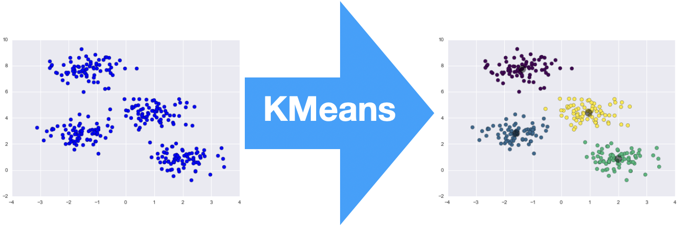

# K_Means
## Table of Contents  
- [About the Project](#1)  
  - [Built with](#2)
- [Usage](#3)
  - [Sequential/Parallel Main](#4)
  - [Plot](#5)
# About the Project <a name="1"/>
 <br/>
Implementation of the K-Means algorithm with the aim of demonstrating the effectiveness of the parallelization of the process by showing the speed-up obtained.

For more information, read the paper located in Repository root.
# Built with <a name="2"/>
 <br/>
Parallelization process was done with [OpenMP](https://www.openmp.org/).
# Usage <a name="3"/>
To run the program simply run the Main class of the project.
### Sequential/Parallel Main <a name="4"/>
To switch from sequential to parallel execution and vice versa, uncomment the line in the CMake file that corresponds to the desired Main between:
```
 add_executable(MidTerm_PC sequential_main.cpp Point.h Cluster.h)
 add_executable(MidTerm_PC parallel_main.cpp Point.h Cluster.h)
```
### Plot <a name="5"/>
To plot the clusters a python script was used with the Matplotlib and Seaborn libraries. <br/>
If you want to plot the graph representing the clusters, just take the text file generated by the plot () method (you can find it in the sequential_main and parallel_main files) and manage it with a simple Python script. <br/>
# Authors
- **Lorenzo Gianassi**
# Acknowledgments
Parallel Computing Project © Course held by Professor [Marco Bertini](https://www.unifi.it/p-doc2-2019-0-A-2b333d2d3529-1.html) - Computer Engineering Master Degree @[University of Florence](https://www.unifi.it/changelang-eng.html)
